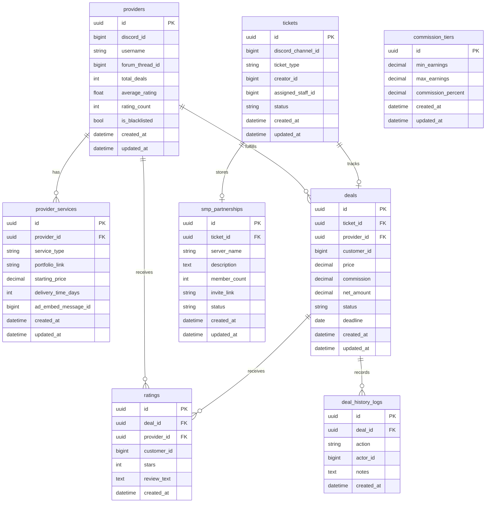
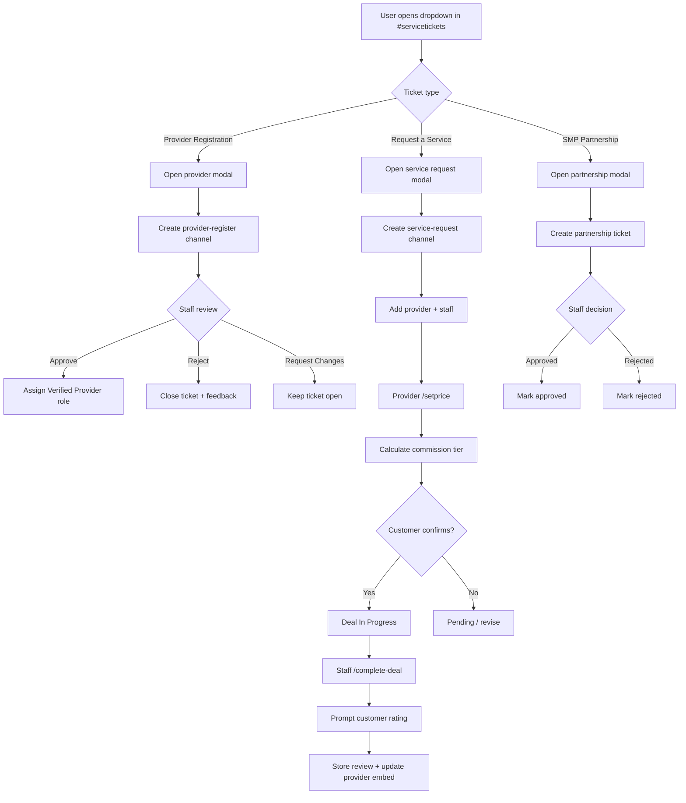
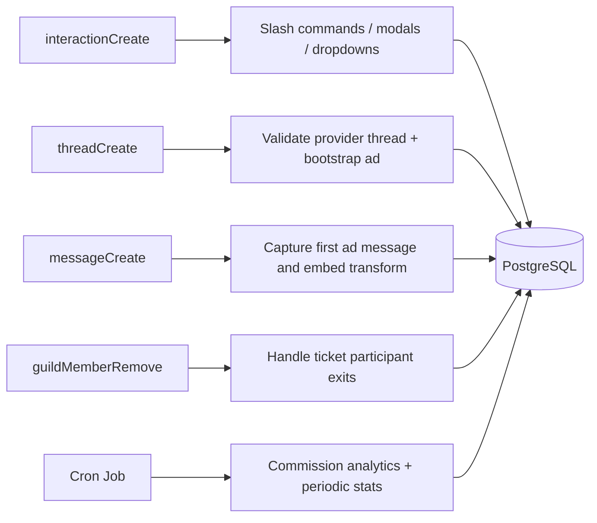

# SMP Hub — Visual Diagrams

## 1) Entity Relationship Diagram (Mermaid)

```mermaid
erDiagram
    providers ||--o{ provider_services : has
    providers ||--o{ deals : fulfills
    providers ||--o{ ratings : receives

    tickets ||--o| deals : tracks
    tickets ||--o| smp_partnerships : stores

    deals ||--o{ ratings : receives
    deals ||--o{ deal_history_logs : records

    providers {
      uuid id PK
      bigint discord_id
      string username
      bigint forum_thread_id
      int total_deals
      float average_rating
      int rating_count
      bool is_blacklisted
      datetime created_at
      datetime updated_at
    }

    provider_services {
      uuid id PK
      uuid provider_id FK
      string service_type
      string portfolio_link
      decimal starting_price
      int delivery_time_days
      bigint ad_embed_message_id
      datetime created_at
      datetime updated_at
    }

    tickets {
      uuid id PK
      bigint discord_channel_id
      string ticket_type
      bigint creator_id
      bigint assigned_staff_id
      string status
      datetime created_at
      datetime updated_at
    }

    deals {
      uuid id PK
      uuid ticket_id FK
      uuid provider_id FK
      bigint customer_id
      decimal price
      decimal commission
      decimal net_amount
      string status
      date deadline
      datetime created_at
      datetime updated_at
    }

    ratings {
      uuid id PK
      uuid deal_id FK
      uuid provider_id FK
      bigint customer_id
      int stars
      text review_text
      datetime created_at
    }

    commission_tiers {
      uuid id PK
      decimal min_earnings
      decimal max_earnings
      decimal commission_percent
      datetime created_at
      datetime updated_at
    }

    deal_history_logs {
      uuid id PK
      uuid deal_id FK
      string action
      bigint actor_id
      text notes
      datetime created_at
    }

    smp_partnerships {
      uuid id PK
      uuid ticket_id FK
      string server_name
      text description
      int member_count
      string invite_link
      string status
      datetime created_at
      datetime updated_at
    }
```

## 2) Ticket and Deal Flow (Mermaid)

```mermaid
flowchart TD
    A[User opens dropdown in #servicetickets] --> B{Ticket type}

    B -->|Provider Registration| C[Open provider modal]
    C --> D[Create provider-register channel]
    D --> E{Staff review}
    E -->|Approve| F[Assign Verified Provider role]
    E -->|Reject| G[Close ticket + feedback]
    E -->|Request Changes| H[Keep ticket open]

    B -->|Request a Service| I[Open service request modal]
    I --> J[Create service-request channel]
    J --> K[Add provider + staff]
    K --> L[Provider /setprice]
    L --> M[Calculate commission tier]
    M --> N{Customer confirms?}
    N -->|Yes| O[Deal In Progress]
    N -->|No| P[Pending / revise]
    O --> Q[Staff /complete-deal]
    Q --> R[Prompt customer rating]
    R --> S[Store review + update provider embed]

    B -->|SMP Partnership| T[Open partnership modal]
    T --> U[Create partnership ticket]
    U --> V{Staff decision}
    V -->|Approved| W[Mark approved]
    V -->|Rejected| X[Mark rejected]
```

## 3) Event-Driven Runtime Map

```mermaid
flowchart LR
    A[interactionCreate] --> B[Slash commands / modals / dropdowns]
    C[threadCreate] --> D[Validate provider thread + bootstrap ad]
    E[messageCreate] --> F[Capture first ad message and embed transform]
    G[guildMemberRemove] --> H[Handle ticket participant exits]
    I[Cron Job] --> J[Commission analytics + periodic stats]
    B --> K[(PostgreSQL)]
    D --> K
    F --> K
    H --> K
    J --> K
```

